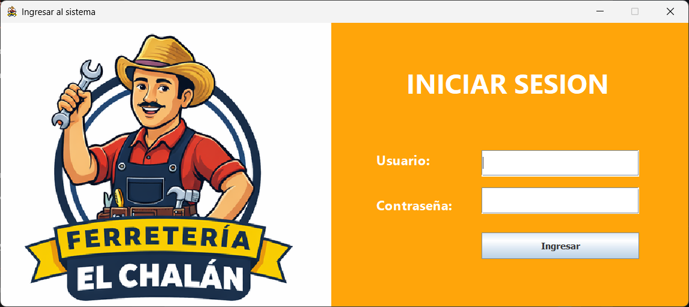
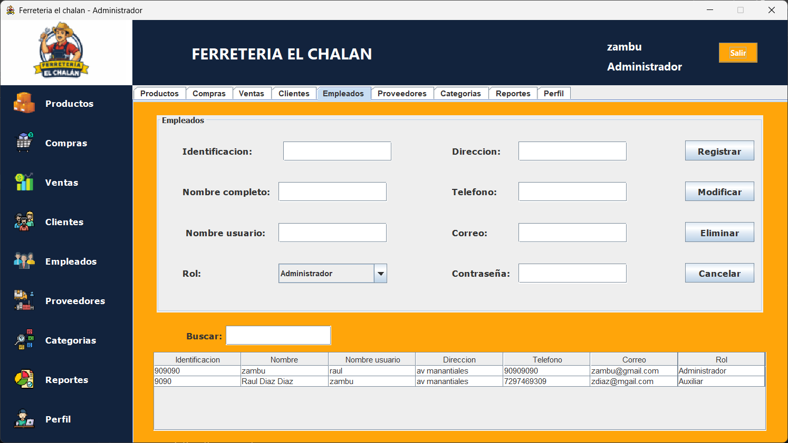
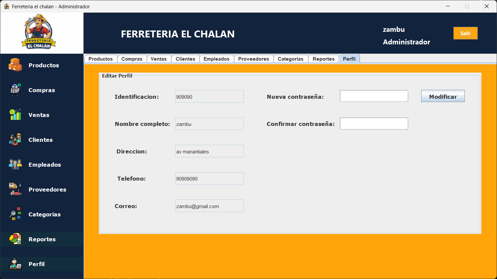
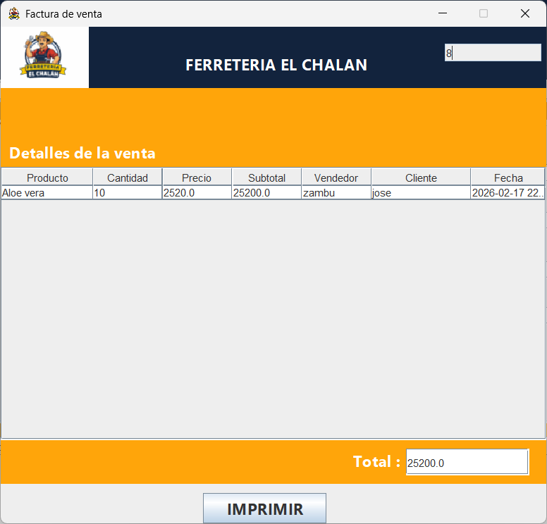

# 🛠 Ferretería El Chalán

Desktop management system built with **Java Swing (NetBeans)** for hardware store administration.

---

## 📌 Overview

**Ferretería El Chalán** is a complete desktop application that allows you to manage a hardware store workflow:

- Products & inventory
- Purchases & sales
- Customers & suppliers
- Employees & roles
- Categories
- Reports
- Invoice generation (printable)
- User authentication and profile management

Built with a classic desktop structure using **Controllers**, **Models/DAO**, **Views**, and **JDBC**.

---

## 🖥 Screenshots

### 🔐 Login

### 🏠 Main Dashboard

---

## 📦 Product Management

**Includes:**
- Register / Modify / Delete products
- Search functionality
- Category assignment
- Inventory/stock control

---

## 🛒 Purchases Module

**Includes:**
- Add products to purchase
- Provider selection
- Automatic subtotal calculations
- Purchase records

---

## 💰 Sales Module

**Includes:**
- Add products to a sale
- Stock validation
- Customer selection
- Sales records

---

## 👥 Customers

**Includes:**
- Register / Modify / Delete customers
- Search and listing

---

## 👨‍💼 Employees & Roles

**Includes:**
- User management (Admin / Auxiliar)
- Login credentials
- Role-based access (depending on implementation)

---

## 🚚 Suppliers

**Includes:**
- Register / Modify / Delete suppliers
- Contact and info management

---

## 🗂 Categories

---

## 📊 Reports

Shows sales and purchases history with totals and dates.

---

## 👤 Profile

Allows updating user information and password changes.

---

## 🧾 Invoices

### Sales Invoice

### Purchase Invoice

---

## ✅ Confirmation Messages

The system displays confirmation and feedback dialogs for actions such as:
- Creating / editing / deleting records
- Completing a sale or purchase
- Generating invoices
- Updating profile information

---

## ⚙ Tech Stack

- Java
- Java Swing (NetBeans)
- JDBC
- MySQL (if configured)
- Ant / NetBeans Project Structure

---

## 🗄 Database

This project uses **MySQL** (if configured).

Configure your database credentials inside:

